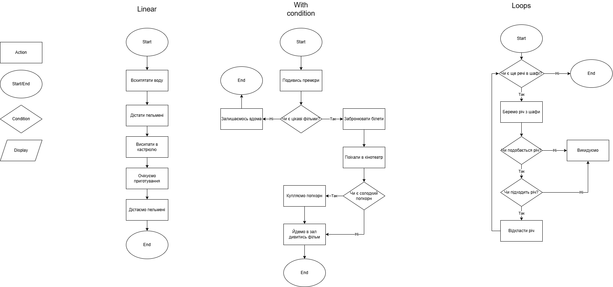

# Algorithms

## Types of algorithms

- Linear (Лінійний) - алгоритм в основі, якого є лінійне виконання алгоритму (без розгалуджень)
- With condition (З розгалудженням) - в такому типі алгоритмів присутнє розгалудження. Якесь питання або ствердження, яке призведе до виконання того чи іншого блоку алгоритму
- Loop (Циклічне) - в цьому типі алгоритму, присутні циклічні дії

## Examples

